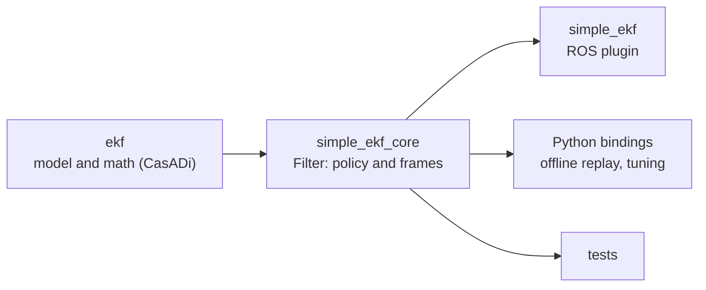

# simple_ekf_core

The `simple_ekf` filter, with no middleware underneath it.

Everything that happens to a measurement between arriving and moving the frame tree lives
here: the rotation into the map frame, the covariance a source is believed with, the
innovation gate, the rewind and replay of delayed measurements, and the smoothing of what
comes out. What is left in the [plugin](../../README.md) is the node's side of it:
parameters, subscriptions, the clock, and publishing.



## The filter reads no clock

`Filter` never calls `now()`. Every time it needs arrives as an argument, so the same
sequence of calls always produces the same sequence of outputs, whether they come from
live subscriptions or from a recording. That is what makes an offline replay of a flight
reproduce what the drone did, to the last bit.

Two different times are involved, and they stay separate:

| | Comes from | Used for |
| --- | --- | --- |
| `sample.stamp` | The measurement itself | Ordering, `dt`, the gate timeout, the rate limit |
| `now` | Whoever received it | Whether a correction is too old to be replayed |

Both are `Nanoseconds`, an `int64_t`. Not seconds in a double: a stamp counted from the
epoch is about 1.7e18 ns and a double holds 53 bits, so seconds would already have lost
the nanoseconds.

## Using it

```cpp
#include <simple_ekf_core/filter.hpp>

simple_ekf_core::Config config;  // defaults are those of config/plugin_default.yaml
simple_ekf_core::Filter filter(config, [](simple_ekf_core::LogLevel, const std::string & line) {
    std::printf("%s\n", line.c_str());
  });

simple_ekf_core::SourceConfig mocap;
mocap.name = "mocap";
mocap.innovation_gate = 5.0;
const simple_ekf_core::SourceId mocap_id = filter.addSource(mocap);

filter.markEarthToMapSet();

filter.onImu(imu);                   // predict
filter.onPose(mocap_id, pose, now);  // correct
filter.onTick(now);                  // smoothing step, pre-flight correction

const simple_ekf_core::Outputs & outputs = filter.outputs();
```

Each source is registered once, and what the filter remembers about it (the last position,
the last fused stamp, how long its gate has been rejecting it) lives with its id. A
`TopicConfig` in the plugin is a `SourceConfig` plus what only ROS needs to know: the topic,
the message type, the rigid body name.

`onTick` is what a timer would drive, and the filter has none: the smoothing's time
constant and the strength of the pre-flight correction are both in ticks, so a replay that
wants the live behaviour ticks at the rate the live system did.

A caller that speaks frame names resolves them to a `SourceFrame` first. The plugin's
`ros_conversions.hpp` is the example: it is the only place that knows a frame id is a
string, or that a measurement was ever a message.

## Python

The bindings expose `Filter` and the types it is driven with, under the same names in
snake_case (`Filter.on_imu`, `Config.map_odom_alpha`). The module carries `ekf` and
`simple_ekf_core` linked in statically, so it needs neither ROS nor this workspace to run.

```sh
cd as2_state_estimator/plugins/simple_ekf/lib/simple_ekf_core
pip install .              # nanobind and scikit-build-core are fetched by pip
pip install '.[examples]'  # and what the example needs: matplotlib, pyyaml, rosbags
```

Building it needs a C++17 compiler, Eigen, and tf2's headers, which `ros-humble-tf2`
installs under `/opt/ros/humble/include`. ROS does not need to be sourced. With the headers
somewhere else, add `--config-settings=cmake.define.TF2_INCLUDE_DIR=<the directory that
contains tf2/LinearMath>`.

```python
import logging

import simple_ekf_core as ekf

logging.basicConfig(level=logging.INFO)  # the filter logs to the "simple_ekf_core" logger

config = ekf.Config()  # defaults are those of config/plugin_default.yaml
estimator = ekf.Filter(config)

mocap = ekf.SourceConfig()
mocap.name = 'mocap'
mocap.position_values = [1.0e-4] * 3
mocap.orientation_values = [1.0e-5] * 3
mocap_id = estimator.add_source(mocap)

estimator.mark_earth_to_map_set()

# Times are integer nanoseconds, and quaternions (x, y, z, w), as in ROS messages
estimator.on_imu(ekf.ImuSample(stamp, [ax, ay, az], [wx, wy, wz]))
pose = ekf.Transform([x, y, z], [qx, qy, qz, qw])
estimator.on_pose(mocap_id, ekf.PoseSample(stamp, ekf.SourceFrame.EARTH, pose,
                                           ekf.generate_covariance_from_config(mocap)), now)
estimator.on_tick(now)

earth_to_base = estimator.outputs.earth_to_base  # .position, .orientation, .rpy, .matrix()
state = estimator.state                          # numpy (15,), ordered as ekf.STATE_NAMES
```

`outputs`, `state` and `state_covariance` are copies, taken when they are read.

### Replaying a bag

[`examples/python/replay_mcap.py`](examples/python/replay_mcap.py) runs the filter over a
recorded flight and plots its estimate over the mocap's. The bag is only read, with
[rosbags](https://gitlab.com/ternaris/rosbags). The filter is fed as the plugin feeds it: the
IMU predicts, the mocap corrects, the platform info says when the drone is offboard, and
`on_tick` runs at `timer_hz`. Every message is handled at the time it was recorded.

```sh
python3 examples/python/replay_mcap.py <bag directory> [--config <yaml>] [--output <png>] [--show]
```

[`replay_mcap.yaml`](examples/python/replay_mcap.yaml) is read before the filter is created.
It holds the filter's `Config` and the mocap's `SourceConfig`, under the bindings' field
names, and the topics to read. Its values are those flight_04 was flown with. On that flight,
all 39,396 states the replay produces are bit-identical to what the ROS plugin publishes
when the same bag is played into it.

## Building

Dependencies: [`ekf`](../ekf/README.md), Eigen, and tf2's header-only `LinearMath` for the
rigid transform type, which is aliased in one file (`rigid.hpp`) so that replacing it is a
change to that file and not a search through the library. Nothing links against rclcpp,
the middleware or any message package:

```console
$ ldd libsimple_ekf_core.so
	libekf.so => ...
	libstdc++.so.6 => ...
	libm.so.6 => ...
	libc.so.6 => ...
```

Inside the ROS package, both libraries are shared. This directory also builds on its own
with plain CMake, adding the `ekf` library itself, and then both come out static. That is
how `pip install` builds the Python module. Build outside the package, where the ament
linters would take CMake's generated sources for the package's own:

```sh
cmake -S . -B /tmp/simple_ekf_core && cmake --build /tmp/simple_ekf_core
```
